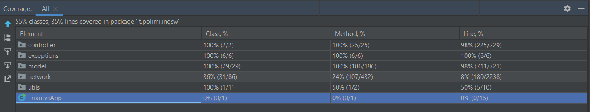
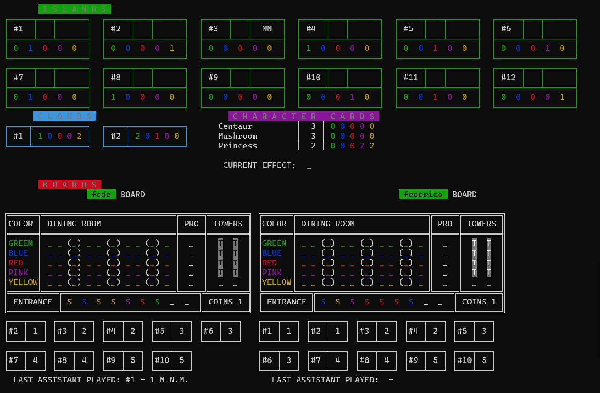

# Software Engineering Project A.A. 2021-2022

**Professor:** Gianpaolo Cugola

**Group:** GC47

**Components:**
- Andrea Scaffidi
- Lucrezia Tagliatti
- Federico Zanon

## Achieved requirements

| Requirements | Achieved |
| ------- | ----------- |
| Complete rules | :heavy_check_mark: |
| CLI | :heavy_check_mark: |
| GUI | :heavy_check_mark: |
| Socket | :heavy_check_mark: |
| Advanced functionality 1 (FA 1) | :heavy_check_mark: Multiple matches |
| Advanced functionality 2 (FA 2) | :heavy_check_mark: All 12 character cards |
| Advanced functionality 3 (FA 3) | :heavy_check_mark: Match for 4 players |

## Testing

Server components (Model and Controller) has been tested by writing unit tests for each class.
The unit tests cover 98% of the lines of the Model and the 98% of the lines of the Controller.



## Compile software and create JAR

The software uses Spring-Boot plugin to create the JAR file.
To compile the software and create the JAR:

1. Install [Java SE 17](https://docs.oracle.com/en/java/javase/17/)
2. Install [Maven](https://maven.apache.org/install.html)
3. Clone this repository
4. Run the following command on maven terminal:
```bash
mvn clean package spring-boot:repackage
```
5. The compiled artifact `softeng-GC47-1.0-SNAPSHOT.jar` will be inside the `target` folder.

**NOTE THAT:** 
- `clean` command is used only to clean the `target` folder.
- All the tests run automatically when compiling the software.

## Run the JAR

#### Run the Server:

In a terminal window, run:
```bash
java -jar softeng-GC47-1.0-SNAPSHOT.jar server
```
**NOTE THAT:**  
By default Server runs on localhost `127.0.0.1` and uses `7268` port. To change the port used add respectively `127.0.0.1` and `PORT_YOU_WANT_TO_USE` to arguments on command line.

#### Run the Client:

In a terminal window, run:

**For the GUI:**
```bash
java -jar softeng-GC47-1.0-SNAPSHOT.jar gui
```


**For the CLI:**
```bash
java -jar softeng-GC47-1.0-SNAPSHOT.jar cli
```



**NOTE THAT:**  
By default Client creates the socket IP: `127.0.0.1` PORT: `7268`. To change these settings add respectively `IP_YOU_WANT_TO_USE` and `PORT_YOU_WANT_TO_USE` to arguments on command line.

## Development

The software has been written using [Java SE 17](https://docs.oracle.com/en/java/javase/17/).

The IDE used for the development is [IntelliJ Idea](https://www.jetbrains.com/idea/).

## Report us bugs

Failing is human, so if you find any bugs in the game please report us as soon as possible.
